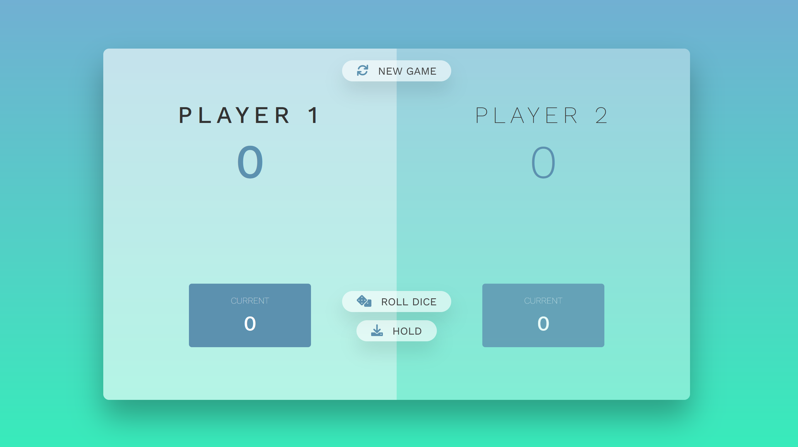

# Pig Game

Course project from Jonas Schmedtmann's JavaScript course (https://www.udemy.com/course/the-complete-javascript-course).

You can see the released project here: https://elenaeslin.github.io/pig-game/

I changed some aesthetic aspects of the interface, making my own HTML and CSS from scratch. The course alrealdy gives the basic files to focus on the JavaScript part, but I wanted to practice my HTML and CSS skills.

The functionality of the game is to roll the dice on each player's turn. The score increments but you have to hold it to save it. If you roll a 1, you lose your actual score and skip turn to the next player.

When you hold the score, it is saved as your general score. If total score reach 100 points, then you win the game.

For this, pure JavaScript is used:

- When you hit the 'roll dice' button, a random dice is displayed and added to your current score
- When you hit the 'hold' button, the current score is added to your total score
- If a player has a score of 100 or more, the game stops.
- When you hit the 'new game' button, the game is reset and you can start again.

I hope you like this game! I really enjoyed learning and improving my skills with this project.
